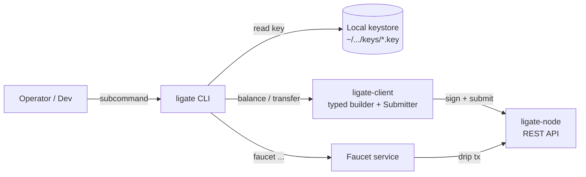

# ligate-cli

[](https://github.com/ligate-io/ligate-cli/actions/workflows/ci.yml) [](#license) [](https://github.com/ligate-io/ligate-chain) [](https://docs.ligate.io) [](#status)

Operator and builder CLI for [Ligate Chain](https://github.com/ligate-io/ligate-chain). One-line wrapper around the typed client SDK: generate keys, query balances, transfer `$LGT`, drip from the faucet, register schemas / attestor sets, submit attestations.

## Quick start

### Install

Two paths, in preference order.

#### 1. Pre-built tarball (recommended)

Each tagged release (`v*` tag) attaches platform tarballs for **linux-x86_64**, **linux-arm64**, **darwin-arm64**, **darwin-amd64**, each with a SHA-256 sidecar. Pick the one for your host:

```bash
# Replace VERSION with the release tag (e.g. v0.1.0-devnet) and
# PLATFORM with one of: linux-amd64, linux-arm64, darwin-arm64,
# darwin-amd64.
curl -L -o ligate.tar.gz \
  https://github.com/ligate-io/ligate-cli/releases/download/VERSION/ligate-VERSION-PLATFORM.tar.gz
tar -xzf ligate.tar.gz
sudo mv ligate /usr/local/bin/
ligate --help
```

No Rust toolchain needed. ~30s end-to-end on a normal connection.

#### 2. Build from source via `cargo install`

Fallback when a tagged tarball isn't published for your platform, or you want to track `main` ahead of a release.

```bash
# Linux: system libclang is required for the chain's transitive
# librocksdb-sys build script (bindgen needs libclang.dylib).
sudo apt install -y libclang-dev clang

# macOS: xcode-select --install (the bundled clang is enough)

# Expect 10–15 min cold-cache, ~5 min warm. Pulls ~3 GiB of git
# deps (chain runtime + SDK fork). Subsequent builds reuse the
# Cargo cache.
SKIP_GUEST_BUILD=1 RISC0_SKIP_BUILD_KERNELS=1 \
  cargo install --git https://github.com/ligate-io/ligate-cli
```

The two env vars skip the risc0 zkVM guest compile — the CLI doesn't run real proving (mock zkvm is fine for client-side use). Without them, you'd also need the `risc0` toolchain (`rzup install`).

`crates.io` publish is blocked until the Sovereign SDK lands there (chain pin is a git dep today). Tracked in [ligate-chain#235](https://github.com/ligate-io/ligate-chain/issues/235).

### Use

```bash
# Generate a keypair (writes to OS keystore dir, mode 0600)
ligate keys generate --name alice

# Show your address
ligate keys show alice

# Claim a one-shot drip from the public devnet faucet
ligate faucet $(ligate keys show alice)

# Check the balance arrived
ligate balance $(ligate keys show alice) --token-id <hex>

# Send some $LGT to another address
ligate transfer \
    --to lig1xyz...                    \
    --amount 0.5                       \
    --signer alice                     \
    --chain-id 1                       \
    --chain-hash <64-char-hex>         \
    --token-id <64-char-hex>
```

All chain-identity flags also accept env vars (`LIGATE_RPC`, `LIGATE_CHAIN_ID`, `LIGATE_CHAIN_HASH`, `LIGATE_LGT_TOKEN_ID`). Set them once in your shell and the flags become optional.

### Shell completions

`ligate completions <SHELL>` prints a completion script to stdout. Pipe to the install path for your shell:

```bash
# zsh (user-level)
ligate completions zsh > ~/.local/share/zsh/site-functions/_ligate

# bash (system-wide)
ligate completions bash | sudo tee /etc/bash_completion.d/ligate

# fish (user-level)
ligate completions fish > ~/.config/fish/completions/ligate.fish

# powershell — append to your $PROFILE
ligate completions powershell >> $PROFILE
```

Then `ligate <TAB>` discovers subcommands; `ligate keys <TAB>` discovers their sub-subcommands; flags tab-complete too.

## Status

**Pre-devnet.** `ligate-devnet-1` is targeted for **Q2 2026**. Tracking issue: [`ligate-chain#112`](https://github.com/ligate-io/ligate-chain/issues/112).

v0 surface (`info`, `keys`, `balance`, `transfer`, `faucet`, `register-attestor-set`, `register-schema`, `sign-attestation`, `submit-attestation`, `query`, `completions`) is wired and CI-green against `ligate-chain` `main`. Only `ligate node start` (operator wrapper around `cargo run --bin ligate-node`) is still deferred.

First tagged release is [`v0.1.0-devnet`](https://github.com/ligate-io/ligate-cli/releases/tag/v0.1.0-devnet) — cut alongside `ligate-chain` `v0.1.0-devnet`. The `Pre-devnet` badge above flips once a 24–48h public soak on Mocha completes; tracking issue [`ligate-cli#21`](https://github.com/ligate-io/ligate-cli/issues/21).

## Commands

### `ligate info`

One-line chain-identity check for the configured RPC. Prints `chain_id`, `chain_hash`, and the node `version` reported by `/v1/rollup/info`. No signing, no keystore touched.

```
ligate info
ligate info --json   # for piping into jq
```

Useful first command in the post-`ligate-node-up` smoke test from [`docs/development/public-devnet-deploy.md`](https://github.com/ligate-io/ligate-chain/blob/main/docs/development/public-devnet-deploy.md). Exports cleanly via `export LIGATE_CHAIN_HASH=$(ligate info --json | jq -r .chain_hash)`.

### `ligate keys`

Local Ed25519 keystore management. Files are written to the OS-default data dir (`~/Library/Application Support/io.ligate.cli/keys` on macOS, `$XDG_DATA_HOME/ligate/keys` on Linux), with `<role>.key` (mode `0600`) and `<role>.address` plaintext.

```
ligate keys generate --name alice [--output PATH]
ligate keys list [--keystore PATH]
ligate keys show alice [--keystore PATH]
ligate keys show alice --pubkey [--keystore PATH]   # bech32m lpk1... for register-attestor-set
```

`generate` also prints the bech32m `lpk1...` pubkey alongside the `lig1...` address, so registering the role as an attestor right after `keys generate` is a copy-paste away.

The on-disk format matches `ligate-genesis-tool keys generate` from the chain repo. Keystores produced by either tool are interchangeable.

### `ligate balance`

Read-only `$LGT` balance query.

```
ligate balance lig1xyz... --token-id <hex>
ligate balance lig1xyz... --token-id <hex> --json
```

### `ligate transfer`

Build a `bank.transfer`, sign it against the chain hash, submit via `ligate-client::submit::Submitter`.

```
ligate transfer \
    --to lig1...                  \
    --amount 1.0                  \  # OR --amount-nano 1000000000
    --signer <role>               \
    --chain-id <u64>              \
    --chain-hash <64-hex>         \
    --token-id <64-hex>           \
    [--max-fee 100000000]
```

### `ligate faucet`

Claim a drip from a deployed faucet service.

```
ligate faucet lig1xyz...
ligate faucet lig1xyz... --faucet-url https://faucet.ligate.io
```

### `ligate register-attestor-set`

Register a quorum of attestor public keys plus an M-of-N threshold. The on-chain id is derived deterministically from the sorted member list, so submitting the same set twice is a no-op.

```
ligate register-attestor-set \
    --members lpk1...,lpk1...,lpk1...    \  # comma-separated, order-independent
    --threshold 2                        \  # 1..=members.len()
    --signer <role>                      \
    --chain-id <u64> --chain-hash <64-hex>
```

Returns the bech32m `las1...` set id on stdout (use `--json` for structured output).

### `ligate register-schema`

Register an attestation schema from a JSON definition file. The schema name + version + attestor-set id collectively make up the on-chain key; bumping `version` is how a schema rotates to a new attestor set.

```
ligate register-schema \
    --file ./themisra-proof-of-prompt-v1.json   \
    --signer <role>                             \
    --chain-id <u64> --chain-hash <64-hex>
```

Schema JSON shape (`name`, `version`, `attestor_set_id`, plus optional `fee_routing_bps` / `fee_routing_address` / `payload_spec_hash`) is documented in the module docstring at [`src/register_schema.rs`](src/register_schema.rs). Returns the `lsc1...` schema id.

### `ligate sign-attestation`

The attestor half of the attestation flow. Produces one entry of the signatures array that `submit-attestation --signatures` consumes. Run on each attestor's machine; the submitter concatenates the outputs into a multi-entry array before submission.

```
ligate sign-attestation \
    --schema lsc1...                              \  # registered schema id
    --payload-hash lph1...                        \  # OR --payload-file <path> to SHA-256 a canonical payload
    --submitter lig1...                           \  # the address that will run submit-attestation
    [--timestamp 0]                               \  # default 0 (chain v0 hardcodes timestamp=0)
    --signer <attestor-role>                      \  # the attestor's keystore role
    [--output sigs.json]                          \  # write the array form; default stdout
    [--json]
```

The chain re-derives the digest at submission time using the same `(schema_id, payload_hash, submitter, timestamp)` tuple. If your inputs here don't match the eventual `submit-attestation`'s `--signer` address, the signature won't verify. The chain's error response now includes the digest it computed and the submitter address it used, so debugging a mismatch is direct.

For the canonical byte layout (and a test vector), see [`docs/protocol/attestation-v0.md`](https://github.com/ligate-io/ligate-chain/blob/main/docs/protocol/attestation-v0.md#signed-payload-for-attestations) §wire-format in the chain repo.

### `ligate submit-attestation`

Submit a threshold-signed attestation under an existing schema. Signatures are collected off-chain (one per attestor) and passed in as a JSON file.

```
ligate submit-attestation \
    --schema lsc1...                          \  # registered schema id
    --payload-hash lph1...                    \  # bech32m hash of the off-chain payload
    --signatures ./sigs.json                  \  # array of { pubkey: lpk1..., sig: hex }
    --signer <role>                           \
    --chain-id <u64> --chain-hash <64-hex>
```

The chain verifies signature count meets the schema's attestor-set threshold and that every signature is from a member of that set.

### `ligate query`

Read-only fetch by id; no signing or keystore touch. Mirrors the three `/v1/...` REST routes the chain exposes.

```
ligate query schema lsc1...                   # registered schema
ligate query attestor-set las1...             # registered attestor set
ligate query attestation lsc1...:lph1...      # attestation (compound id)
```

## Global flags

| Flag | Env | Default | Notes |
|---|---|---|---|
| `--rpc URL` | `LIGATE_RPC` | `https://rpc.ligate.io` | Target node REST endpoint |
| `--json` | n/a | off | Emit JSON instead of human text |
| `RUST_LOG` | env only | `warn` | tracing filter |

## Architecture



`keys generate` lifts the chain genesis-tool's keystore logic byte-for-byte. `transfer` mirrors the faucet's signer pipeline (one-shot per invocation, fetches nonce from chain). `balance` is a pure read against `NodeClient::get_balance_for_holder`. `faucet` is just an HTTP client to a deployed faucet's `POST /faucet`.

## Why a separate repo

- Different release cadence (operator-driven, faster than chain releases).
- Different scaling concerns (zero, it's a CLI tool with a stable v0 surface).
- Same pattern as `ligate-explorer`, `ligate-faucet`.
- Versioned via crates.io once mature; pre-1.0 distributed as `cargo install --git ...`.

## Development

```bash
cargo build       # compile
cargo run -- --help
cargo fmt
cargo clippy --all-targets -- -D warnings
```

The `cargo test` job is currently disabled in CI because the chain's risc0 prover crate (transitively pulled via `ligate-rollup`) trips its build script under `cargo test` even with `SKIP_GUEST_BUILD=1`. Pure-keystore unit tests live under `mod tests` in `keys.rs` and `config.rs` and run via `cargo check --all-targets`.

### Pre-commit hooks

`.pre-commit-config.yaml` runs `cargo fmt --check` on every commit so formatting drift is caught locally instead of in CI. One-time setup per clone:

```bash
brew install pre-commit         # or: pip install pre-commit
pre-commit install              # writes .git/hooks/pre-commit
```

Skip the hook for an emergency commit with `git commit --no-verify`; the same check still re-runs in CI.

## Related

- Tracking: [`ligate-chain#112`](https://github.com/ligate-io/ligate-chain/issues/112)
- Chain SDK: [`ligate-io/ligate-chain/crates/client-rs`](https://github.com/ligate-io/ligate-chain/tree/main/crates/client-rs)
- Faucet: [`ligate-io/faucet`](https://github.com/ligate-io/faucet)
- Genesis-tool keys: [`ligate-io/ligate-chain/crates/genesis-tool`](https://github.com/ligate-io/ligate-chain/tree/main/crates/genesis-tool)

## License

Apache-2.0 OR MIT, at your option. See [`LICENSE-APACHE`](LICENSE-APACHE) and [`LICENSE-MIT`](LICENSE-MIT).
