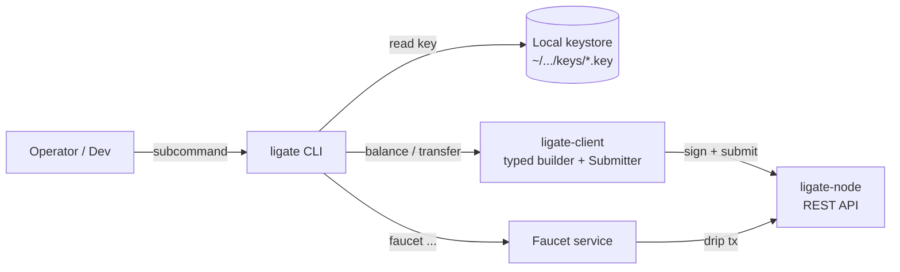

# ligate-cli

[](https://github.com/ligate-io/ligate-cli/actions/workflows/ci.yml) [](#license) [](https://github.com/ligate-io/ligate-chain) [](https://docs.ligate.io) [](#status)

Operator and builder CLI for [Ligate Chain](https://github.com/ligate-io/ligate-chain). One-line wrapper around the typed client SDK: generate keys, query balances, transfer `$LGT`, drip from the faucet.

## Quick start

### Install

```bash
# Required first install (Ubuntu/Debian)
sudo apt install -y libclang-dev clang
# macOS:  xcode-select --install

cargo install --git https://github.com/ligate-io/ligate-cli
```

Once mature, will publish to crates.io.

### Use

```bash
# Generate a keypair (writes to OS keystore dir, mode 0600)
ligate keys generate --name alice

# Show your address
ligate keys show alice

# Claim a one-shot drip from the public devnet faucet
ligate faucet $(ligate keys show alice)

# Check the balance arrived
ligate balance $(ligate keys show alice) --token-id <hex>

# Send some $LGT to another address
ligate transfer \
    --to lig1xyz...                    \
    --amount 0.5                       \
    --signer alice                     \
    --chain-id 1                       \
    --chain-hash <64-char-hex>         \
    --token-id <64-char-hex>
```

All chain-identity flags also accept env vars (`LIGATE_RPC`, `LIGATE_CHAIN_ID`, `LIGATE_CHAIN_HASH`, `LIGATE_LGT_TOKEN_ID`). Set them once in your shell and the flags become optional.

## Status

**Pre-devnet.** `ligate-devnet-1` is targeted for **Q2 2026**. Tracking issue: [`ligate-chain#112`](https://github.com/ligate-io/ligate-chain/issues/112).

v0 surface (`keys`, `balance`, `transfer`, `faucet`) is wired and CI-green. Remaining v0 surface (`attest`, `schema`, `attestor-set`, `node`) is gated on the chain-side modules they consume.

## Commands

### `ligate keys`

Local Ed25519 keystore management. Files are written to the OS-default data dir (`~/Library/Application Support/io.ligate.cli/keys` on macOS, `$XDG_DATA_HOME/ligate/keys` on Linux), with `<role>.key` (mode `0600`) and `<role>.address` plaintext.

```
ligate keys generate --name alice [--output PATH]
ligate keys list [--keystore PATH]
ligate keys show alice [--keystore PATH]
```

The on-disk format matches `ligate-genesis-tool keys generate` from the chain repo. Keystores produced by either tool are interchangeable.

### `ligate balance`

Read-only `$LGT` balance query.

```
ligate balance lig1xyz... --token-id <hex>
ligate balance lig1xyz... --token-id <hex> --json
```

### `ligate transfer`

Build a `bank.transfer`, sign it against the chain hash, submit via `ligate-client::submit::Submitter`.

```
ligate transfer \
    --to lig1...                  \
    --amount 1.0                  \  # OR --amount-nano 1000000000
    --signer <role>               \
    --chain-id <u64>              \
    --chain-hash <64-hex>         \
    --token-id <64-hex>           \
    [--max-fee 100000000]
```

### `ligate faucet`

Claim a drip from a deployed faucet service.

```
ligate faucet lig1xyz...
ligate faucet lig1xyz... --faucet-url https://faucet.ligate.io
```

## Global flags

| Flag | Env | Default | Notes |
|---|---|---|---|
| `--rpc URL` | `LIGATE_RPC` | `https://rpc.ligate.io` | Target node REST endpoint |
| `--json` | n/a | off | Emit JSON instead of human text |
| `RUST_LOG` | env only | `warn` | tracing filter |

## Architecture



`keys generate` lifts the chain genesis-tool's keystore logic byte-for-byte. `transfer` mirrors the faucet's signer pipeline (one-shot per invocation, fetches nonce from chain). `balance` is a pure read against `NodeClient::get_balance_for_holder`. `faucet` is just an HTTP client to a deployed faucet's `POST /faucet`.

## Why a separate repo

- Different release cadence (operator-driven, faster than chain releases).
- Different scaling concerns (zero, it's a CLI tool with a stable v0 surface).
- Same pattern as `ligate-explorer`, `ligate-faucet`.
- Versioned via crates.io once mature; pre-1.0 distributed as `cargo install --git ...`.

## Development

```bash
cargo build       # compile
cargo run -- --help
cargo fmt
cargo clippy --all-targets -- -D warnings
```

The `cargo test` job is currently disabled in CI because the chain's risc0 prover crate (transitively pulled via `ligate-rollup`) trips its build script under `cargo test` even with `SKIP_GUEST_BUILD=1`. Pure-keystore unit tests live under `mod tests` in `keys.rs` and `config.rs` and run via `cargo check --all-targets`.

## Related

- Tracking: [`ligate-chain#112`](https://github.com/ligate-io/ligate-chain/issues/112)
- Chain SDK: [`ligate-io/ligate-chain/crates/client-rs`](https://github.com/ligate-io/ligate-chain/tree/main/crates/client-rs)
- Faucet: [`ligate-io/faucet`](https://github.com/ligate-io/faucet)
- Genesis-tool keys: [`ligate-io/ligate-chain/crates/genesis-tool`](https://github.com/ligate-io/ligate-chain/tree/main/crates/genesis-tool)

## License

Apache-2.0 OR MIT, at your option. See [`LICENSE-APACHE`](LICENSE-APACHE) and [`LICENSE-MIT`](LICENSE-MIT).
